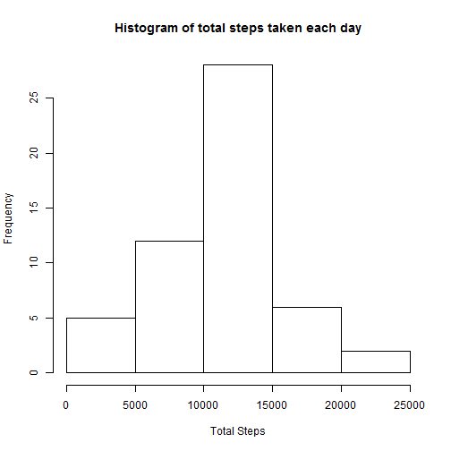
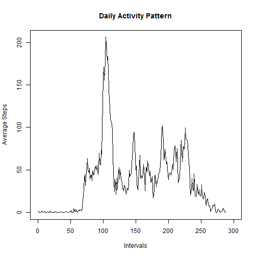
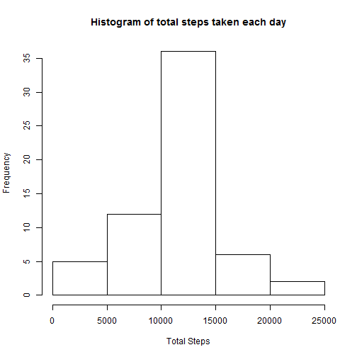
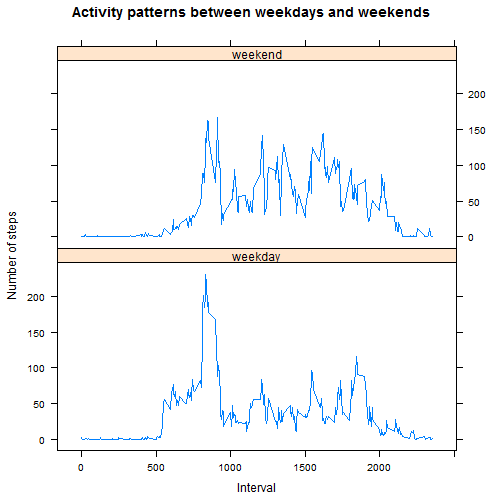

#Reproducible Research Assignment 1


##Introduction
This assignment makes use of data from a personal activity monitoring device. This device collects data at 5 minute intervals through out the day. 
The data consists of two months of data from an anonymous individual collected during the months of October and November, 2012 and 
include the number of steps taken in 5 minute intervals each day.


##Data Source

**Dataset** Available here: [https://d396qusza40orc.cloudfront.net/repdata%2Fdata%2Factivity.zip](https://d396qusza40orc.cloudfront.net/repdata%2Fdata%2Factivity.zip)

**Fileformat** CSV

17,568 observations

**Variables:**

* _steps_: Number of steps taking in a 5-minute interval (missing values are coded as NA)

* _date_: The date on which the measurement was taken in YYYY-MM-DD format

* _interval_: Identifier for the 5-minute interval in which measurement was taken


##Loading and preprocessing the raw data


```r
activity <- read.csv("./activity.csv")

summary(activity)
```

```
##      steps                date          interval     
##  Min.   :  0.00   2012-10-01:  288   Min.   :   0.0  
##  1st Qu.:  0.00   2012-10-02:  288   1st Qu.: 588.8  
##  Median :  0.00   2012-10-03:  288   Median :1177.5  
##  Mean   : 37.38   2012-10-04:  288   Mean   :1177.5  
##  3rd Qu.: 12.00   2012-10-05:  288   3rd Qu.:1766.2  
##  Max.   :806.00   2012-10-06:  288   Max.   :2355.0  
##  NA's   :2304     (Other)   :15840
```

```r
# Making date as factors

date1 <- as.factor(activity$date)

activity$date <- date1
```


##Mean total number of steps taken per day

###Total Number of Steps Taken Per Day


```r
TotalStepPerDay <- tapply(activity$steps,activity$date,sum)

hist(TotalStepPerDay,main="Histogram of total steps taken each day", xlab="Total Steps")
```

 


###Calculate mean and median total number of steps taken per day


```r
meanSteps <- mean(TotalStepPerDay, na.rm=T)

medianSteps <- median(TotalStepPerDay, na.rm=T)

cat("Mean total number of steps taken per day is: ", meanSteps)
```

```
## Mean total number of steps taken per day is:  10766.19
```

```r
cat("Median total number of steps taken per day is: ", medianSteps)
```

```
## Median total number of steps taken per day is:  10765
```


##Average daily activity pattern

###Time Series Plot, Interval with Max number of steps

```r
mean5minSteps <- data.frame(tapply(activity$steps,activity$interval,mean, na.rm=TRUE))


plot(mean5minSteps, type="l", main = "Daily Activity Pattern", xlab="Intervals", ylab="Average Steps",
	xlim=c(0, 300))
```

 

```r
# which.max() gives index number of the max 5-minute value

cat("Interval ", which(mean5minSteps==max(mean5minSteps)), " contains the maximum number of steps.")
```

```
## Interval  104  contains the maximum number of steps.
```

##Imputing Missing Values

###Calculate and report the total number of missing values in the dataset


```r
cat("There are ", sum(is.na(activity)) , " missing values in the dataset.")
```

```
## There are  2304  missing values in the dataset.
```

###Strategy for filling in missing values in the dataset

The easiest way to replace NA yet not significantly change the data patter would be 

* Calculate the mean number of steps per 5-minute time interval without NAs
* Replacing NAs with the mean for that interval


###Create a new dataset with this strategy 


```r
### make a new copy of activity data

activityNARM <- activity

mean5minSteps <- data.frame(tapply(activity$steps,activity$interval,mean, na.rm=TRUE))


# create an index of NAs and loop through the index in the activityNoNA file
# replacing NAs with the mean for that interval


activityNARM[,1][is.na(activityNARM[,1])]<-mean5minSteps[,1]
```

###Historgram with new Dataset


```r
TotalStepPerDayNARM <- tapply(activityNARM$steps,activityNARM$date,sum)

hist(TotalStepPerDayNARM,main="Histogram of total steps taken each day", xlab="Total Steps")
```

 


###Calculate mean and median total number of steps taken per day


```r
meanStepsNARM <- mean(TotalStepPerDayNARM, na.rm=T)

medianStepsNARM <- median(TotalStepPerDayNARM, na.rm=T)

cat("Mean total number of steps taken per day is: ", meanStepsNARM)
```

```
## Mean total number of steps taken per day is:  10766.19
```

```r
cat("Median total number of steps taken per day is: ", medianStepsNARM)
```

```
## Median total number of steps taken per day is:  10766.19
```

Obviously, imputing missing data in this way increases the number of steps taken per day along the mean value.

The values for mean amd median in the new dataset is the same, which is the same mean value of the origian dataset. 

 

##Difference in Activity Patterns Between Weeekdays and Weekends

Continue this analysis with the modified dataset without NAs.


###Adding new variable for weekend/weekday

Add a new variable to the new activity file specifying the day of the week.
Then the data will be plotted as a panel plot containing a time series plot (i.e. type = "l") of the 5-minute interval (x-axis) 
and the average number of steps taken, averaged across all weekday days or weekend days (y-axis).


```r
# Add a new variable "daytype", and set default to "weekday"

activityNARM$daytype <- "weekday"


# Check for day of week as a weekend, if true, reset daytype to "weekend"


for (i in 1:length(activityNARM$steps)) {

    if (weekdays(as.Date(activityNARM$date[i])) == "Saturday"|weekdays(as.Date(activityNARM$date[i]))=="Sunday" ) 

        { activityNARM$daytype[i] = "weekend" }

}

# Aggrateing data according to the dates, taking mean values, creat a new dataset with three variables:
# interval, datatype, steps. 

meansteps=aggregate(steps~interval+daytype,activityNARM,mean)

# use the new dataset for plotting in the next step
```

### Weekday weekend comparison charts
Time series plot of 5-minute interval


```r
library(lattice)

xyplot( meansteps$steps ~ meansteps$interval| meansteps$daytype, 
  	main="Activity patterns between weekdays and weekends",
        xlab="Interval",  ylab = "Number of steps", type="l",
        layout=c(1,2))
```

 
